# Losing Spirals: Causal Triggers and Early Warning in 625,000 On-Chain Gambling Bets

  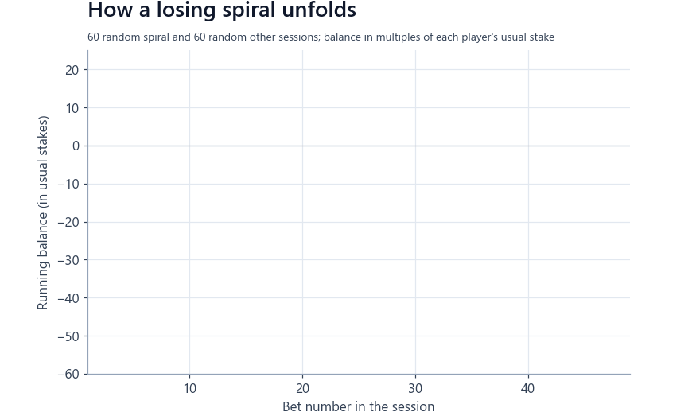

Every bet on a blockchain dice game is public, timestamped and, given the odds the player chose, **decided by a fair
random draw**. That turns 625,361 real bets into a natural experiment on how people react to winning and losing, and
into a test bed for spotting harmful play before it happens.

This project asks three questions:

1. **What does a win or a loss *cause*?** (causal effects, not correlations)
2. **Can a "losing spiral" be flagged early, after only 5 bets of a session?** (validated on unseen players and on a second platform)
3. **What kinds of players are there, and who is at risk?** (behavioural typology)

> **Status:** independent research project (2026). Full code is available on request for academic collaboration (see [Code availability](#code-availability)).

---

## Key findings

| | Finding |
|---|---|
| **Harm is concentrated** | 2.4% of sessions (the "spirals") account for **50%** of all money lost; the top 1% of players account for **56%** of expected losses. |
| **A loss causes escalation** | After a loss, the chance that the next stake jumps to at least 4× the player's usual stake is **3.2× higher** than after a win. This holds for players who *never* double after losses (×9.2), not only for "martingale" players. |
| **An early win pulls people back** | Winning the first-ever bet raises the chance of coming back by **+13 percentage points** (about 1 extra returning player per 8 first-bet wins). Small wins pull hardest (+22 pp). |
| **Break-even matters** | While behind, a win keeps people playing, unless it brings them back to even: then quitting jumps (a difference-in-discontinuities design). |
| **Spirals can be flagged early** | At bet 5 of a session, a model flags **8 in 10** future spirals among unseen players (AUC **0.81**), although at that point future spirals still look normal on their balance. |
| **It transfers** | Applied unchanged to a different platform and era (SatoshiDice, Bitcoin, 2012-13), the model keeps most of its performance (AUC **0.73** vs 0.76 for a model trained there). |
| **Two distinct strategies, one continuum** | Players form two distinct groups (system doublers; rapid-fire long-shot bettors) plus a mainstream in which spiral risk rises steadily with stake size. |

---

## 1. Harm is concentrated

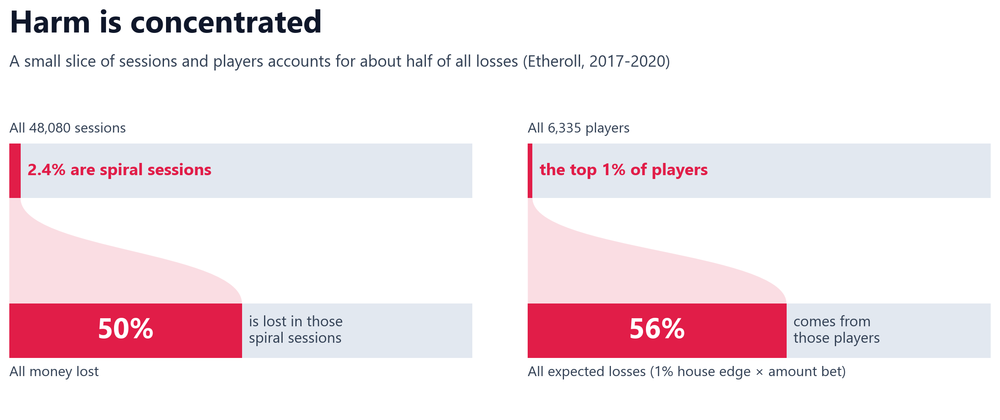

A **spiral session** is defined as a session in which the stake reaches at least 4× the player's usual stake *and* the
player loses at least 20 usual stakes. The definition was fixed before modelling and checked against six alternative
definitions (see Robustness).

## 2. Causal effects of winning and losing

Given the odds the player chose, whether a bet wins is decided by chance. Comparing wins and losses **within the same
chosen odds and stake size** therefore gives causal effects, checked with placebo tests (the stake chosen *before* the
dice roll shows no "effect", as it should). Loss chasing is a core feature of problem gambling [8]; quitting at
break-even has been reported before with other designs [9].

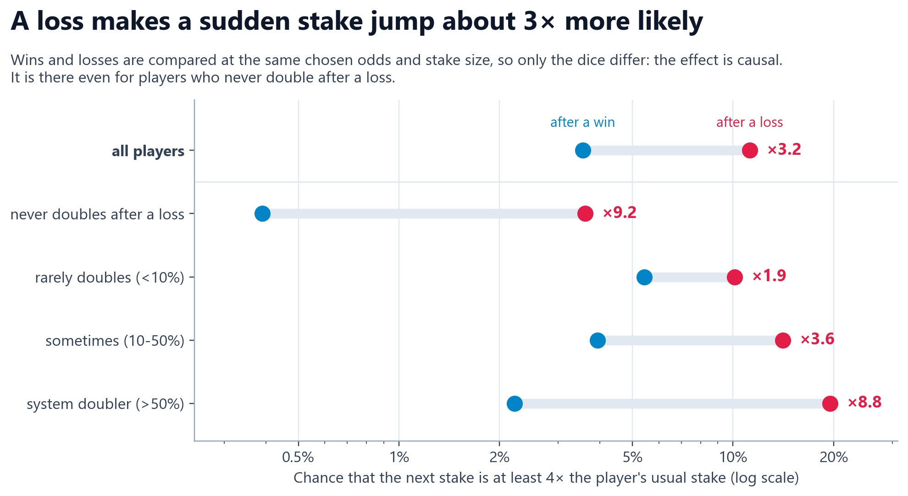

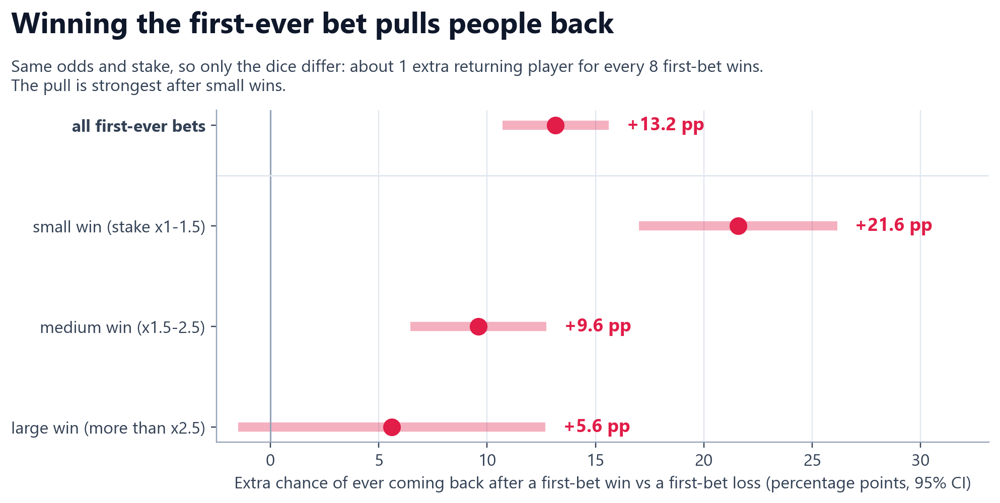

Break-even effect (click to expand)

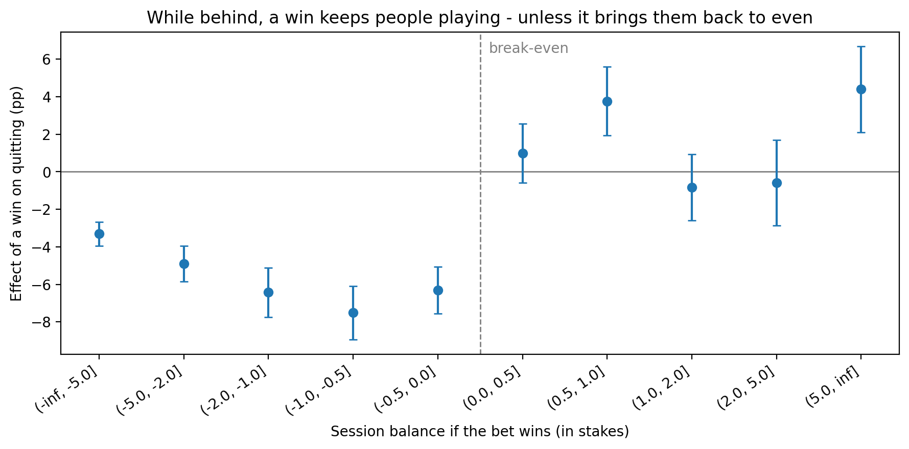

## 3. Early warning: flagging a spiral after 5 bets

**Design (built to avoid leakage):**
- One row per session, using only information available **at bet 5**: what happened in the first five bets and the player's earlier history.
- Sessions that already met the spiral definition at bet 5 are removed, so the model predicts the future only.
- **Wallet-grouped, time-ordered 70/30 split:** no player appears in both training and test, and test players arrived later.
- Model and alert threshold chosen by grouped cross-validation **inside the training set only**.
- 95% confidence intervals by bootstrap over **players**, not sessions.
- Reporting follows TRIPOD+AI [1] and current guidance on performance measures [2]: discrimination, calibration [3],
  precision-recall for a rare outcome [4], alert burden [5] and decision curves [6]. Both validation sets (294 and
  1,887 spirals) have well over 100 events, as recommended for validation [7].

**Test set:** 6,252 sessions from 1,113 unseen players, 294 spirals (4.7%).

| Metric | Value | What it means |
|---|---|---|
| AUC | **0.81** (95% CI 0.79–0.84) | A random spiral session gets a higher risk score than a random normal session 81% of the time |
| Calibration (observed / expected) | **1.03** | Predicted risks match observed rates |
| Net benefit (decision curve) | **Positive** for alert thresholds of 1–20% | Acting on the model beats alerting everyone or no one |
| Sensitivity / specificity | **0.80** / 0.69 | 8 in 10 future spirals are flagged at bet 5 |
| Negative predictive value | **0.986** | Sessions that are not flagged are almost always safe |
| Average precision | 0.19 | **4×** better than a random ranking (spiral rate 0.047) |
| Median lead time | **34 minutes** | Time left to intervene before the spiral criteria are met |

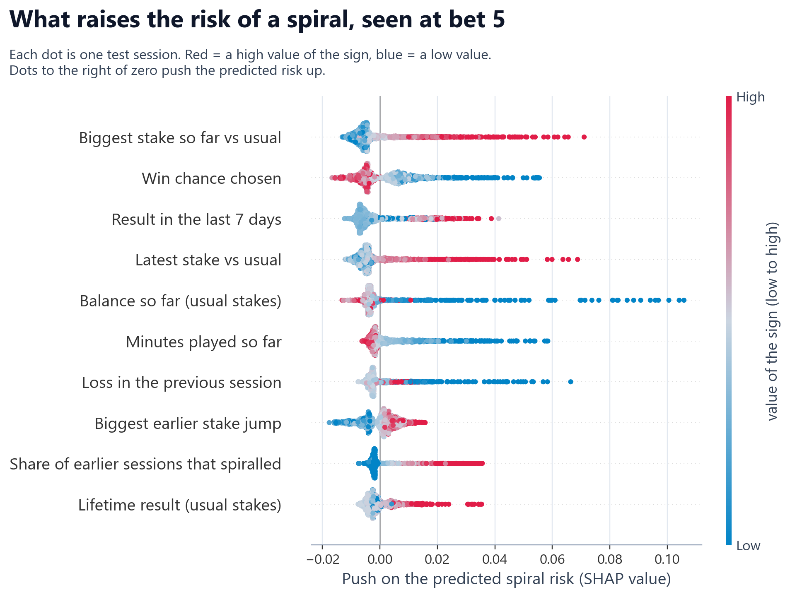

**Precision.** Spirals are rare (4.7% of sessions), so any early-warning model for them raises some false alarms. Alerts
are 2.4× more likely than chance to be spirals at the default threshold, and **7.8×** when only the riskiest 1% of
sessions are flagged. This is typical for rare outcomes: a widely deployed hospital sepsis model reached a positive
predictive value of 12% at a sensitivity of 33% [16]; this model reaches a similar value at a sensitivity of 80%. It is
meant for low-cost interventions such as reality-check messages.

Why false alarms are not wasted, and why precision has a ceiling (click to expand)

- Many "false" alarms are near-misses: those players spiral within their next five sessions 3.8× more often than players in quiet sessions, and these sessions hold 61% of the money lost outside spirals.
- With a 1% house edge, about 94% of a spiral's loss comes from the dice after the alert point, which no model can foresee.

Diagnostics: precision-recall, calibration, decision curve (click to expand)

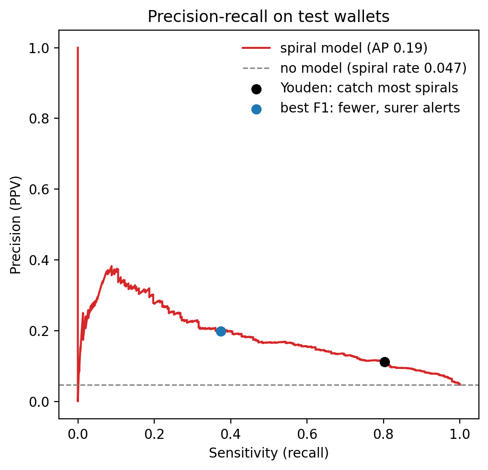
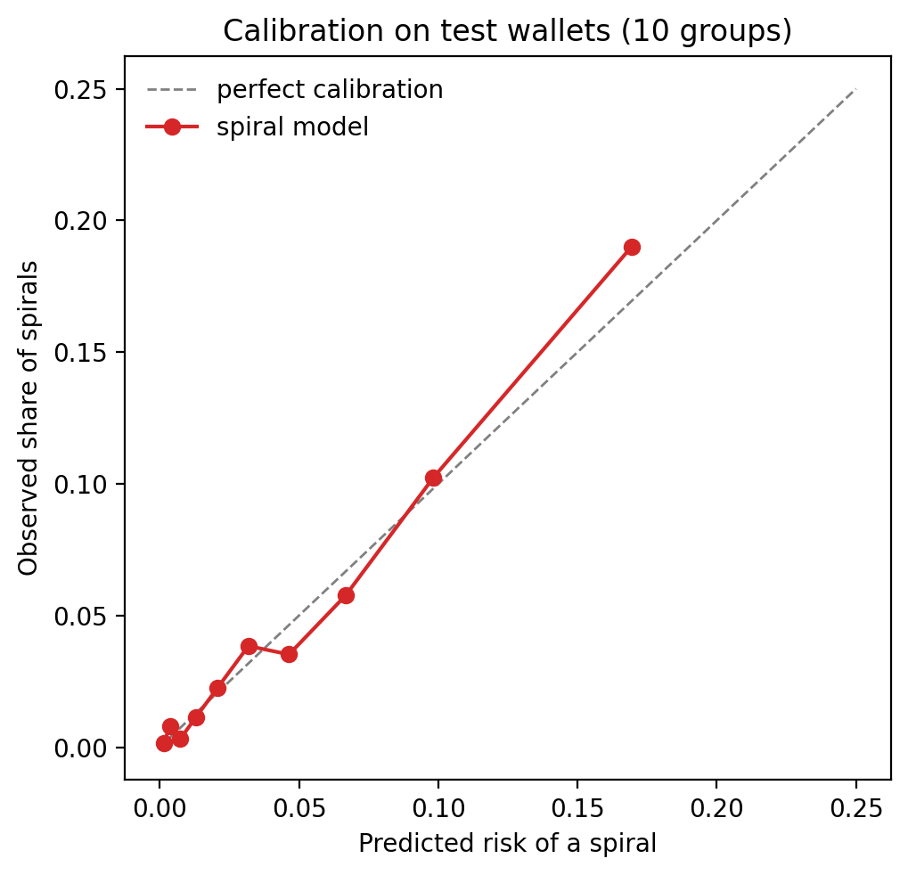
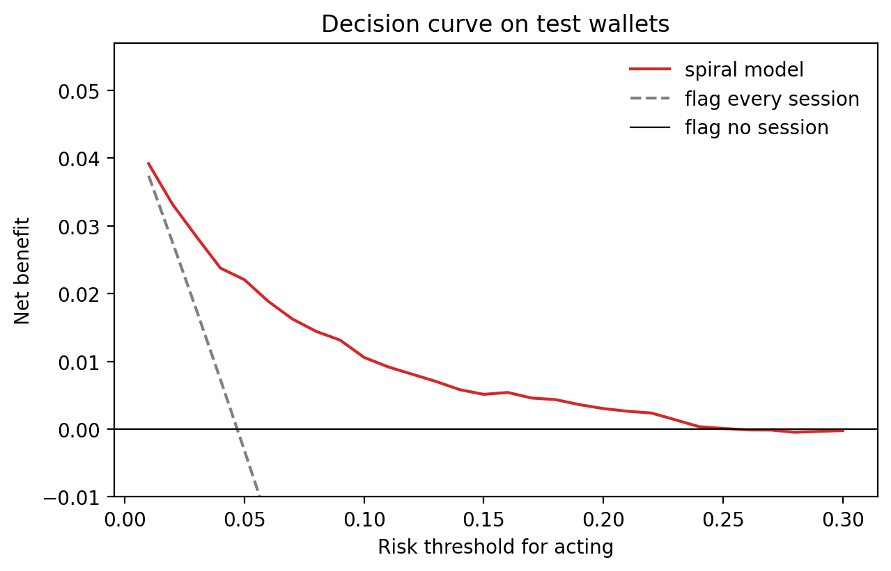

### External validation on another platform

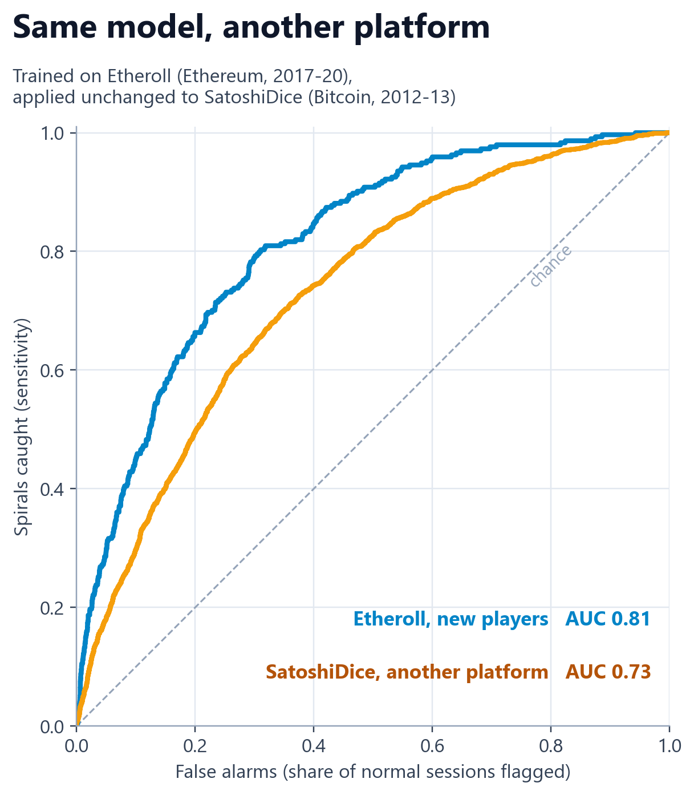

The ranking of risk transfers, but the alert threshold does not: predicted risks run higher on SatoshiDice, so the
Etheroll threshold would flag about two thirds of sessions there, and the threshold must be set locally. The same
dataset has been used before to predict problem gamblers at the player level with machine learning [15]; this project
instead predicts single sessions in real time and uses the data for external validation.

## 4. Who are the players?

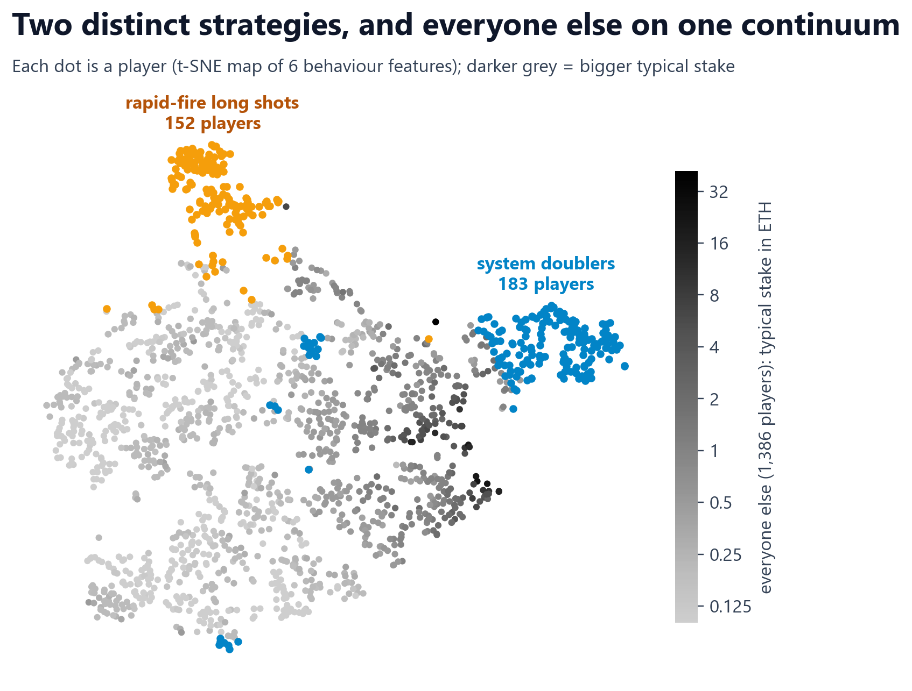

Clustering 1,721 players (at least 30 bets each) on six behaviour features, compared across KMeans, Gaussian mixtures,
Ward, spectral clustering and HDBSCAN with silhouette and bootstrap stability, gives **two distinct strategies** and
**one mainstream continuum**. Within the mainstream, the share of sessions that turn into spirals rises steadily with
the typical stake.

---

## Robustness

- Five random wallet-grouped splits: test AUC 0.79–0.82.
- Sessions that still looked calm at bet 5: AUC 0.81.
- Six alternative spiral definitions: AUC 0.76–0.86.
- Newer models (LightGBM, XGBoost, histogram gradient boosting) did not beat the random forest.
- External validation on a second platform, era and currency (above).

## Limitations

- **Wallets are not people.** One person can use several wallets, and a wallet can be shared.
- **Behaviour, not diagnosis.** A spiral is a behavioural pattern in the data, not a clinical diagnosis of gambling disorder; there is no self-reported outcome.
- **Crypto dice players are not typical gamblers.** Results may not generalise to other forms of gambling.
- **Causal claims** cover the immediate effect of a win or a loss (randomised by the dice), not the model's features, which are predictive only.

## Ethics and statement of use

The aim of this project is **harm reduction**: understanding and flagging loss-chasing behaviour. To be explicit:

- **Only public data were used:** public blockchain records and a published open dataset. No private, purchased or leaked data.
- **No one was identified or contacted.** No attempt was made to link wallets to real people. Wallet addresses were replaced by internal ids, and none are published here.
- **No raw data are shared** in this repository.
- **No gambling took place.** The author placed no bets and did not interact with any gambling contract or website.
- **No commercial use.** The results were not used, and are not offered, to help any operator increase play or revenue. The model is intended only to support protective interventions such as reality-check messages.
- **No funding and no conflicts of interest.** The project is independent and not affiliated with any gambling operator or platform.

## References

1. Collins GS, Moons KGM, Dhiman P, et al. TRIPOD+AI statement: updated guidance for reporting clinical prediction models that use regression or machine learning methods. *BMJ* 2024;385:e078378.
2. Van Calster B, Collins GS, Vickers AJ, et al. Evaluation of performance measures in predictive artificial intelligence models to support medical decisions: overview and guidance. *Lancet Digital Health* 2025. Preprint: Performance evaluation of predictive AI models to support medical decisions: overview and guidance. arXiv:2412.10288, doi:10.48550/arXiv.2412.10288.
3. Van Calster B, McLernon DJ, van Smeden M, et al. Calibration: the Achilles heel of predictive analytics. *BMC Medicine* 2019;17:230.
4. Saito T, Rehmsmeier M. The precision-recall plot is more informative than the ROC plot when evaluating binary classifiers on imbalanced datasets. *PLoS ONE* 2015;10(3):e0118432.
5. Romero-Brufau S, Huddleston JM, Escobar GJ, Liebow M. Why the C-statistic is not informative to evaluate early warning scores and what metrics to use. *Critical Care* 2015;19:285.
6. Vickers AJ, Elkin EB. Decision curve analysis: a novel method for evaluating prediction models. *Medical Decision Making* 2006;26(6):565-574.
7. Collins GS, Ogundimu EO, Altman DG. Sample size considerations for the external validation of a multivariable prognostic model. *Statistics in Medicine* 2016;35(2):214-226.
8. Zhang K, Clark L. Loss-chasing in gambling behaviour: neurocognitive and behavioural economic perspectives. *Current Opinion in Behavioral Sciences* 2020;31:1-7.
9. Lien JW, Zheng J. Deciding when to quit: reference-dependence over slot machine outcomes. *American Economic Review* 2015;105(5):366-370.
10. Breiman L. Random forests. *Machine Learning* 2001;45:5-32.
11. Lundberg SM, Erion G, Chen H, et al. From local explanations to global understanding with explainable AI for trees. *Nature Machine Intelligence* 2020;2:56-67.
12. van der Maaten L, Hinton G. Visualizing data using t-SNE. *Journal of Machine Learning Research* 2008;9:2579-2605.
13. Pedregosa F, Varoquaux G, Gramfort A, et al. Scikit-learn: machine learning in Python. *Journal of Machine Learning Research* 2011;12:2825-2830.
14. Sándor MC. SatoshiDice (dataset, version 1.1.0). Zenodo, 2021. doi:10.5281/zenodo.5600259. Licensed under CC BY 4.0.
15. Sándor MC, Bakó B. Unmasking risky habits: identifying and predicting problem gamblers through machine learning techniques. *Journal of Gambling Studies* 2024;40:1367-1377.
16. Wong A, Otles E, Donnelly JP, et al. External validation of a widely implemented proprietary sepsis prediction model in hospitalized patients. *JAMA Internal Medicine* 2021;181(8):1065-1070.

## Data

- **Etheroll** (Ethereum, May 2017 - April 2020): 625,361 bets, 6,335 wallets, read from the public event logs of the game's smart contracts on the Ethereum blockchain. This project was built using data retrieved through the Etherscan.io APIs ("Powered by [Etherscan.io](https://etherscan.io) APIs"). The project is not affiliated with Etheroll or Etherscan.
- **SatoshiDice** (Bitcoin, 2012-2013): "SatoshiDice" dataset by Máté Csaba Sándor, version 1.1.0, Zenodo, [doi:10.5281/zenodo.5600259](https://doi.org/10.5281/zenodo.5600259) [14], licensed under [CC BY 4.0](https://creativecommons.org/licenses/by/4.0/). Changes: bets were grouped into sessions and summarised into the same features as for Etheroll; the dataset itself is not redistributed here.

## Tools

Python, pandas, scikit-learn [13] (random forest [10]), LightGBM, XGBoost, SHAP [11], t-SNE [12], matplotlib.

## Code availability

The full analysis (a single reproducible notebook) is kept private for now. I am happy to share it with researchers for
academic collaboration: please get in touch.

## Collaboration

I am open to collaborating with researchers and operators who hold account-level data, to extend the early-warning model
to real-money platforms.

## How to cite

See [`CITATION.cff`](CITATION.cff), or use the "Cite this repository" button on GitHub.

## License

Copyright © 2026 Amir Asgari. All rights reserved. See [LICENSE](LICENSE).
